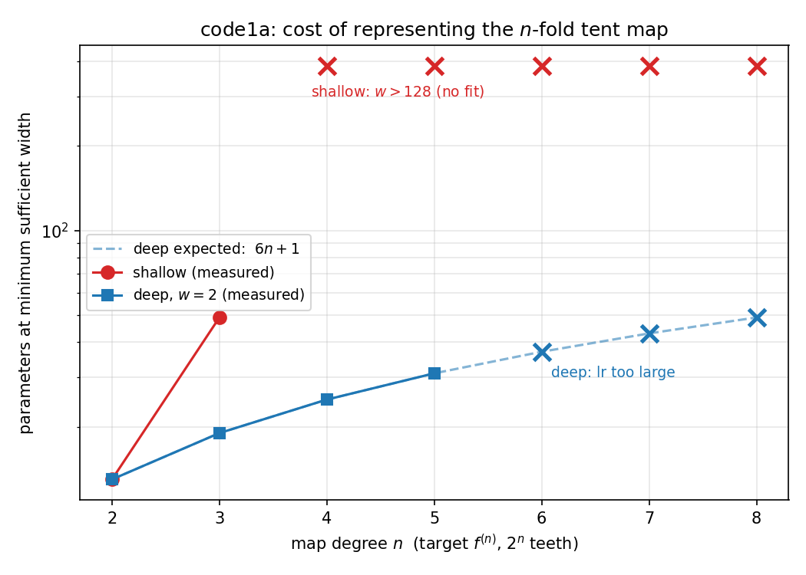
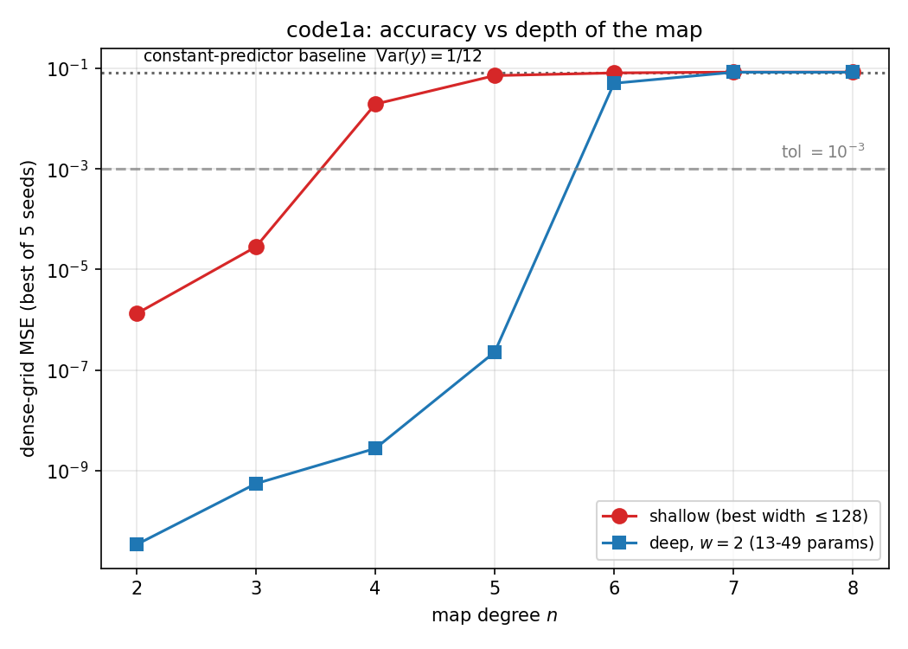
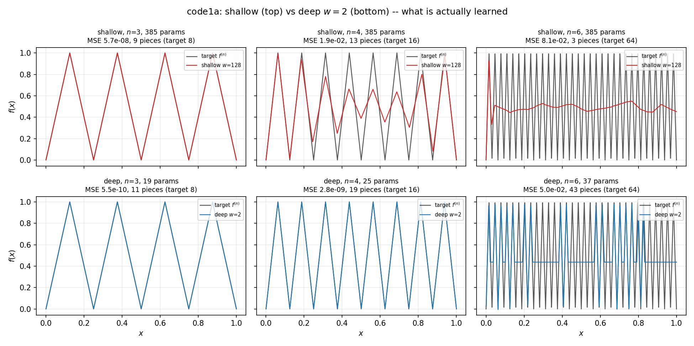

# Folding by Depth: A Hands-On Reproduction of Width–Depth Separation in ReLU Networks Learning Iterated Maps

## Introduction

**Objective:** This exercise demonstrates the difference between the width and depth of a multi-layer perceptron (MLP) in controlling its ability to learn iterated maps that produce non-injective relationships. 

**Outcome:** By contrasting the training of a shallow MLP (one hidden layer) and a deep MLP ($n$ hidden layers) on the $n$-fold iterated _tent map_, we show that depth attains the learning objective with the number of trainable parameters growing linearly in $n$, whereas the shallow network fails to train at any width up to 128 for $n \ge 4$ despite possessing more than sufficient representational capacity. Therefore, depth is the more efficient knob in two distinct ways: 
1. it needs exponentially fewer parameters to *represent* the target (explicitly demonstrated by the parameter counts at $n = 2, 3$);
2. it remains *trainable* in a regime where the width-matched shallow network is defeated by the vanishing gradients known for this function class. 

**References**
1. M. Telgarsky, [arXiv:1509.08101](
https://doi.org/10.48550/arXiv.1509.08101); [arXiv:1602.04485](
https://doi.org/10.48550/arXiv.1602.04485).
1. G. Montúfar, R. Pascanu, K. Cho, and Y. Bengio, [arXiv:1402.1869](
https://doi.org/10.48550/arXiv.1402.1869).
1. E. Malach, G. Yehudai, S. Shalev-Shwartz, and O Shamir, [arXiv:2102.00434](https://doi.org/10.48550/arXiv.2102.00434)


---
## Architectures

**The Map:** The tent-map $f: [0,1] \to [0,1]$ and it is given by
```math
f(x) = 1 - |1 - 2x|.
```
Thus, it is a $2$-to-$1$ map. 
Iterating it $n$ times converts it to a $2^n$-to-$1$ map, 
```math
f_n(x) = 1 - |(2^n x \; \text{mod} \; 2) - 1|
```
while preserving the definition of the domain and range.

### Two types of MLPs
**Shallow MLP:** The shallow MLP contains one hidden layer of width $w$. It can be shown by information theoretic arguments that in order for this network to represent $f_n$, the number of nodes/neurons $w \geq 2^n-1$. This leads to an exponential scaling of the number of trainable parameters in the shallow MLP with $n$.

**Deep MLP:** The deep MLP contains $N$ hidden layers, each of width $w$. It can be shown by the same type of arguments as above that if $N \sim n$, then $w = \mathcal{O}(1)$. Therefore, the numer of trainable parameters in the deep MLP scales _linearly_ with $n$. Here, in order to easily contrast the deep-MLP with its shallow counterpart, we will fix $w=2$ in the former.


### Initial weights 
While the $n$-scaling of the number of parameters in the two MLPs can be determined _a priori_, a successful training of these networks crucially depends on the choice of the initial weights. This is demonstrated by `code0.py`. This script contains a straightforward comparison between the two types of MLP architectures discussed above with the initial weights in both networks assigned randomly. We find that 
* the deep MLP fails to train with the test accuracy hovering around the variance in the input data; 
* the shallow MLP trains only at a few select widths, depending on the seed fed to the random number generator.


**The Problem:** The main challenge here is to use the ReLU network to represent a piecewise continuous function with many segments (controlled by $n$). In order for a ReLU-based approximator, $\phi(x) = s_0 x + \sum_j s_j \sigma(x - a_j)$ with $\sigma(x)$ being the ReLU function, to be sensititve to the segmentations in $f_n(x)$, it  must possess a sufficient number of ReLU-hinges or breakpoints within the interval $x \in [0,1]$. The naive random initialization of the networks prevents this from happening: if both the weight ($W_j$) and the bias ($b_j$) acting on the $j$-th node/neuron is sampled from a uniform distribution, then the location where $(W_j x + b_j)$ vanishes, $x=-b_j/W_j$, typically lies outside $[0,1]$. The "naive" algorithm in `code0.py` fails because of this reason.

**Solution-Part 1:** To fix this issue, in `code1.py`, we deterministically assign the initial weights and biases in such a way that all the breakpoints of $\phi(x)$ lies within $[0,1]$. In fact, to help the gradient descent find the desired solution, we initiate the network weights and biases in the vicinity of the expected solution as follows.

* _Shallow MLP_: We initialize as 
```
k = torch.linspace(0.0, 1.0, w + 2)[1:-1]                 
sign = torch.where(torch.arange(w) % 2 == 0, 1.0, -1.0)
W = 2.0 * sign
self.layers[0].weight.copy_(W.unsqueeze(1))
self.layers[0].bias.copy_(-W * k)
self.layers[2].weight.normal_(0.0, 1.0 / max(w, 1) ** 0.5)
self.layers[2].bias.zero_()
```
Here, `k = torch.linspace(0.0, 1.0, w + 2)[1:-1]` creates an evenly spaced grid of $w+2$ points from $0$ to $1$, and then slices off the boundaries (`1:-1` removes the $0.0$ and $1.0$). These are the target breakpoint locations $a_j$ for the $w$ hidden units. They are guaranteed to be strictly inside the domain.
The subsequent lines,
``` 
sign = torch.where(torch.arange(w) % 2 == 0, 1.0, -1.0)
W = 2.0 * sign
self.layers[0].weight.copy_(W.unsqueeze(1))
```
generates a weight vector $\mathbf{W}$ of $[+2.0, -2.0, +2.0, -2.0, ...]$. Note that the sign of $W_j$ determines the direction of the ReLU: $\sigma(2x + b_j)$ are "right-active"; $\sigma(-2x + b_j)$ are left-active. By  alternating them, the network gets a perfectly balanced basis of features—half looking right, half looking left—which prevents a massive, lopsided accumulation of slopes.

The next line, `self.layers[0].bias.copy_(-W * k)`, assigns the biases such that the kink/break-point of every unit $j$ locates exactly on the grid point $k_j$.

Finally, 
```
self.layers[2].weight.normal_(0.0, 1.0 / max(w, 1) ** 0.5)
self.layers[2].bias.zero_()
```
initializes the output layer with standard random weights drawn from a Normal distribution with variance $1/w$.

In summary, _the deterministic initialization of the weights and biases of the hidden layer ensures that 100% of the network's structural capacity (the $w$ hinges) is optimally distributed inside the active domain, leaving the output layer to figure out exactly how to linearly combine these perfectly placed basis functions._


* _Deep MLP_: We implement the same strategy for the deep MLP. We only focus on the first two nodes/neurons of each hidden layer. Because we will fix the width $w=2$ for all hidden layers this is sufficient. This strategy also works unchanged for $w > 2$ because of the structure of the iterated tent-map (it only grows as $2^n \Rightarrow$ two assignment changes per layer is sufficient).
```
self.first_hidden.weight.zero_(); self.first_hidden.bias.zero_()
self.first_hidden.weight[0, 0] = 1.0
self.first_hidden.weight[1, 0] = 1.0
self.first_hidden.bias[1] = -0.5
for layer in self.rest_hidden:
	layer.weight.zero_(); layer.bias.zero_()
	layer.weight[:2, :2] = torch.tensor([[2.0, -4.0], [2.0, -4.0]])
	layer.bias[:2] = torch.tensor([0.0, -0.5])
self.out.weight.zero_(); self.out.bias.zero_()
self.out.weight[0, :2] = torch.tensor([2.0, -4.0])
for p in self.parameters():
	p.add_(noise * torch.randn_like(p))
```
For a deep network to repeatedly fold the input, each layer needs a specific two-component signal. The first hidden layer translates the raw scalar input $x$ into this format:
```
self.first_hidden.weight.zero_(); self.first_hidden.bias.zero_()
self.first_hidden.weight[0, 0] = 1.0
self.first_hidden.weight[1, 0] = 1.0
self.first_hidden.bias[1] = -0.5
```
Unit $0$ gets $W=1, b=0 \implies \sigma(x)$. Since $x \in [0,1]$, this simply passes $x$ forward. Unit 1 gets $W=1, b=-0.5 \implies \sigma(x - 0.5)$. This is the shifted component. The output of the first layer is the 2D state vector: $\mathbf{u} = \big(x, \sigma(x - 0.5)\big)^T$.

The rest of the hidden layers are initialized iteratively such that they preserve the same structure of the output of first hidden layer:  
```
for layer in self.rest_hidden:
    layer.weight.zero_(); layer.bias.zero_()
    layer.weight[:2, :2] = torch.tensor([[2.0, -4.0], [2.0, -4.0]])
    layer.bias[:2] = torch.tensor([0.0, -0.5])
```
It takes the two-component vector $\mathbf{u}$ from the previous layer and applies the tent function: $f(u) = 2\sigma(u) - 4\sigma(u - 0.5)$. Notice that both rows of the weight matrix are identical: $[2.0, -4.0]$. Row $0$ computes: $2u_0 - 4u_1$. Because $\mathbf{u} = \big(x, \sigma(x-0.5)\big)$, this exactly evaluates $f(x)$. After the ReLU, it remains $f(x)$ because the tent function is strictly non-negative. Row 1 computes: $2u_0 - 4u_1 - 0.5$. This evaluates $f(x) - 0.5$. After the ReLU, it becomes $\sigma(f(x) - 0.5)$. Therefore, the output state of this layer: $\big(f(x), \sigma(f(x) - 0.5)\big)^T$. _It is the exact same format as the input state_, just with $x$ replaced by $f(x)$. Because the state shape is preserved, we can stack as many of these identically wired layers as we want. Each layer folds the space in half, doubling the number of teeth in the sawtooth approximator of $f_n$.

The output layer collapses the 2D state back down to a scalar output,
```
self.out.weight.zero_(); self.out.bias.zero_()
self.out.weight[0, :2] = torch.tensor([2.0, -4.0])
```
By applying weights $[2.0, -4.0]$ and a zero-bias, it executes one final tent function $f(\cdot)$ on the state from the last hidden layer, yielding the final highly oscillatory output $y$.

Finally, we add a perturbation to the pristine initialization in the previous steps to help the gradient descent 
```
for p in self.parameters():
    p.add_(noise * torch.randn_like(p))
```
This serves two practical purposes, (1) it provides a degree of robustness to the `Adam` based optimizer by giving it some room to optimize, especially while working under the restriction of two-nodes-per-hidden-layer ($w=2$) [this is the reason behind `code1a.py`'s existence]; (2) it gives a sense of the basin of attraction of the putative fixed point characterized by the pristine initialization. As we shall see, the converged results do not exactly match the theoretical expectations with the number of segments required for the MLP-approximator generally exceeding the theoretical sufficient-minimum.

**Solution-Part 2:** Although `code1.py` offers a vast improvement over `code0.py` it still fails to produce a sufficiently quick convergence for $n\geq 5$. To improve upon this deficiency we make a small change to initialization of the output layer of `code1.py` by giving it a depth-sensitive "jitter" by the following change:
```diff
-                    p.add_(noise * torch.randn_like(p))
+                    p.add_(noise * 2.0 ** -n * torch.randn_like(p))
```
This improves the convergence, benchmarked as follows.


## Results

All three scored identically: dense grid `linspace(0,1,20001)`, sup-norm, and a piece counter (second-difference kinks) compared against `2^n`. The width of each hidden layer of the deep MLP is pinned at `w=2`; the shallow MLP's width is swept over `w in {2,4,8,16,32,64,128}`, so `w > 128` means
no width in that range reached within a tolerance of `tol = 1e-3`.

### code0.py — the random initialization

`lr=1e-3`, full batch, 20000 epochs, **1 seed**, default `nn.Linear` init.

| n | shallow min w | params | gridMSE | deep w=2 | gridMSE | pieces | 2^n |
|---|---|---|---|---|---|---|---|
| 2 | 8 | 25 | 1.56e-09 | fail | 8.336e-02 | 1 | 4 |
| 3 | 16 | 49 | 2.28e-10 | fail | 8.335e-02 | 1 | 8 |
| 4 | 128 | 385 | 9.91e-07 | fail | 8.338e-02 | 1 | 16 |
| 5 | w > 128 | — | 3.92e-02 | fail | 8.339e-02 | 1 | 32 |
| 6 | w > 128 | — | 7.93e-02 | fail | 8.338e-02 | 1 | 64 |
| 7 | w > 128 | — | 8.44e-02 | fail | 8.340e-02 | 1 | 128 |
| 8 | w > 128 | — | 8.49e-02 | fail | 8.341e-02 | 1 | 256 |

**The deep network does not work at any depth.** `8.33e-02` is `Var(y) = 1/12`,
the best-fit constant through the dataset, and `pieces = 1` confirms that the model is a flat line. 

**The shallow network's performance is a lottery, with no discernable trend visible.** Sweep at `n=3`:

```
w=  2  8.185e-02     w= 16  2.202e-10  <- succeeds
w=  4  8.196e-02     w= 32  5.185e-02  <- fails
w=  8  6.520e-02     w= 64  6.515e-09  <- succeeds
                     w=128  2.477e-09  <- succeeds
```
Whether a given width works is decided by
how many ReLU-hinges happen to land within $[0,1]$. 

### code1.py — deterministic inits

`lr=1e-2`, minibatch 256, cosine schedule, 800 epochs, best of 5 seeds.

| n | shallow min w | params | gridMSE | deep w=2 params | gridMSE | pieces | 2^n |
|---|---|---|---|---|---|---|---|
| 2 | 4 | 13 | 1.33e-06 | 13 | 2.666e-11 | 6 | 4 |
| 3 | 16 | 49 | 2.83e-05 | 19 | 5.409e-10 | 11 | 8 |
| 4 | w > 128 | — | 1.94e-02 | 25 | 4.114e-08 | 21 | 16 |
| 5 | w > 128 | — | 7.16e-02 | 31 | 3.001e-02 | 30 | 32 |
| 6 | w > 128 | — | 8.09e-02 | 37 | 5.564e-02 | 45 | 64 |
| 7 | w > 128 | — | 8.39e-02 | 43 | 8.152e-02 | 5 | 128 |
| 8 | w > 128 | — | 8.40e-02 | 49 | 8.338e-02 | 1 | 256 |

The deep network now works up to `n=4` on **25 parameters**, where shallow
already needs more than 385. 
The lottery-like behavior of the shallow MLP is gone and we see a trend of progressive degradation with increasing $n$.

At $n=3$ a comparison between the two network architectures highlights higher efficiency of the deep ML in not only representing $f_n$, but also learning/approximating it.

**NOTE:** The `pieces` column is reporting the number of segments the approximator has and it should be bounded from below by the pieces in the actual function, i.e. $2^n$. So this code and parameter choices are reliable for the deep-MLP only upto $n=4$.

### code1a.py — the depth-dependent "jitter"

Identical to `code1` in every other respect, but the deep ML now runs reliably up to $n=5$:

| n | shallow min w | params | gridMSE | deep w=2 params | gridMSE | pieces | 2^n |
|---|---|---|---|---|---|---|---|
| 2 | 4 | 13 | 1.33e-06 | 13 | 3.416e-11 | 6 | 4 |
| 3 | 16 | 49 | 2.83e-05 | 19 | 5.549e-10 | 11 | 8 |
| 4 | w > 128 | — | 1.94e-02 | 25 | 2.776e-09 | 19 | 16 |
| 5 | w > 128 | — | 7.16e-02 | 31 | **2.281e-07** | 41 | 32 |
| 6 | w > 128 | — | 8.09e-02 | 37 | 5.037e-02 | 43 | 64 |
| 7 | w > 128 | — | 8.39e-02 | 43 | 8.337e-02 | 1 | 128 |
| 8 | w > 128 | — | 8.40e-02 | 49 | 8.338e-02 | 1 | 256 |

The shallow column is **identical by construction** — `ShallowMLP` has no noise term, so the changed line cannot affect it.

**Visualization of the data**
* The number of parameter required to represent $f_n(x)$ by the two networks is plotted below. Note that further refinements, e.g. lowering the `lr` at larger $n$ improves the performance of the deep MLP.
 

* The accuracy of the learned representations are plotted below through the eyes of `gridMSE`.  

* The comparison of the degradation of the learned-approximator with $n$ between the shallow and deep MLPs is plotted below:



***The importance of the jitter:*** A comparison of the `gridMSE` reveals the impact of the depth-dependent jitter term,
| n | code1 (fixed jitter) | code1a (`2^-n`) | ratio |
|---|---|---|---|
| 2 | 2.666e-11 | 3.416e-11 | — |
| 3 | 5.409e-10 | 5.549e-10 | — |
| 4 | 4.114e-08 | 2.776e-09 | 15x |
| 5 | 3.001e-02 | 2.281e-07 | **131,566x** |
| 6 | 5.564e-02 | 5.037e-02 | — |
| 7 | 8.152e-02 | 8.337e-02 | — |
| 8 | 8.338e-02 | 8.338e-02 | — |

We also note that the number of `pieces` at $n=4$ for the deep MLP has reduced from $21 \to 19$.

***Why the jitter works:*** Since each tent block has gain 2, so a perturbation at the first fold is amplified by `2^n` at the output. A *fixed* jitter is therefore not a fixed perturbation; its effect doubles with every layer. Measured init grid-MSE at `w=2`
(`0` = exact; `8.3e-2` = Var$(y)$ baseline):

| n | code1 init | code1a init |
|---|---|---|
| 2 | 5.88e-03 | 1.06e-04 |
| 4 | 3.90e-02 | 4.48e-04 |
| 6 | **1.32e-01** | 1.52e-04 |
| 8 | **1.81e-01** | 9.97e-05 |

By `n=6` the `code1` starting point is *worse than predicting a constant* (exceeds Var$(y)$).
Scaling by `2^-n` cancels the amplification and holds the init at `~1e-4` at
every depth.


## Conclusion and Discussion
Here, we have clearly demonstrated the efficiency of a deep MLP against its shallow counterpart for representing and learning many-to-1 functions whose complexity grows exponentially with each iteration.


We note that our findings resonate with recent similar works, especially
* V. Chatziafratis, S. G. Nagarajan, I. Panageas, and X. Wang, [arXiv:1912.04378](https://doi.org/10.48550/arXiv.1912.04378).
* M. Milkert, D. Hyde, and F. Laine, [arXiv:2311.18022](https://doi.org/10.48550/arXiv.2311.18022).

## Codebase
This codebase is composed of:

```
code0.py                     the naive build
code1.py                     code0.py + deterministic initialization + few other tweaks, including seed-averaging
code1a.py                    code1.py + one line (2^-n jitter scaling)

run_code0.py                 benchmarks code0  on a dense grid
run_code1a.py                comparison between shallow & deep MLPs
plot_code1a.py               plots three figures summarizing the output of code1a.py

code1a_fig3_functions.png    shallow- vs deep-MLPs, what is actually learned
code1a_fig1_params_vs_n.png  parameters at minimum sufficient width vs n
code1a_fig2_mse_vs_n.png     accuracy vs n
```

Requires only `numpy`, `torch`, `matplotlib`. 


